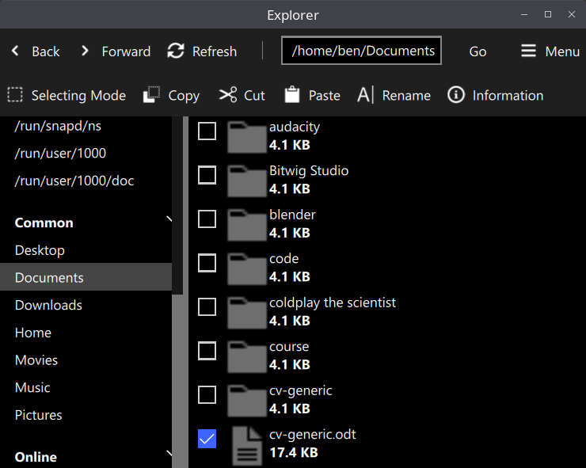

# explorer
A file browser for any platform.

## Building
### Qt Creator
I used Qt 6.2.1 toolkit for building, and used Qt's IDE, Creator, for development and building.
To install the toolkit, go to https://www.qt.io/download-open-source and click "Download Open Source"
and then launch the downloaded executable, following the steps to install Qt.

When you've finished with the installer, open Qt Creator, and open the CMakeLists.txt file. Then,
configure the project with the active kit. You should be able to build or run the target executable.

## Credits
Icons taken from Adobe Spectrum (https://spectrum.adobe.com/page/icons/)
